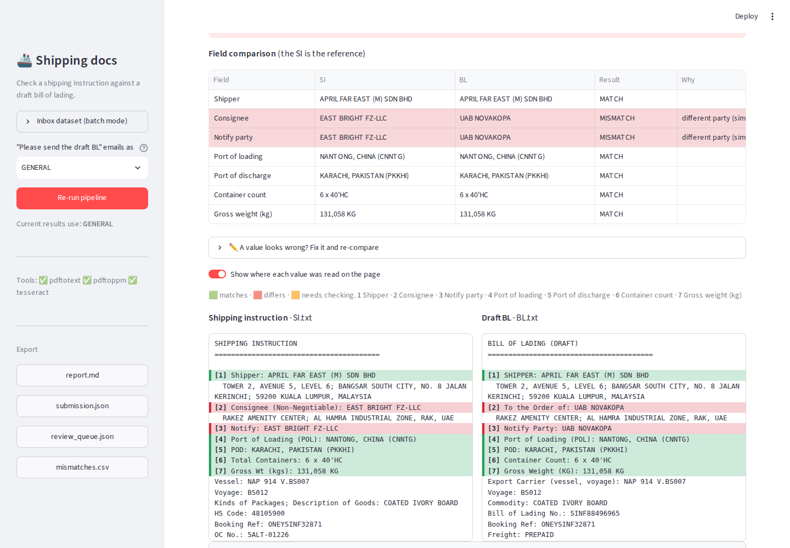
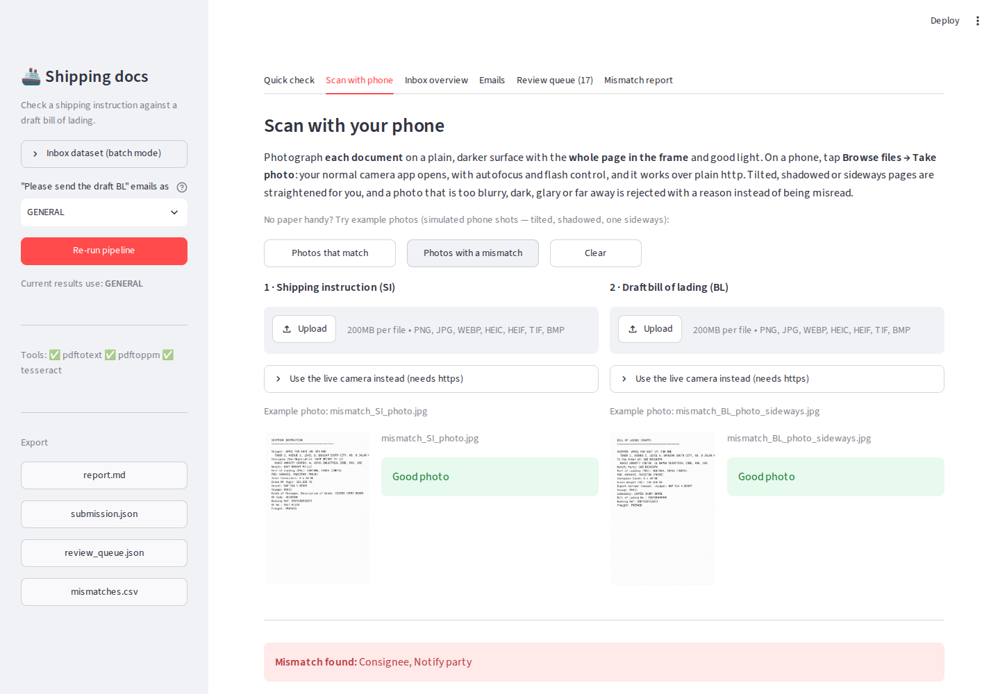
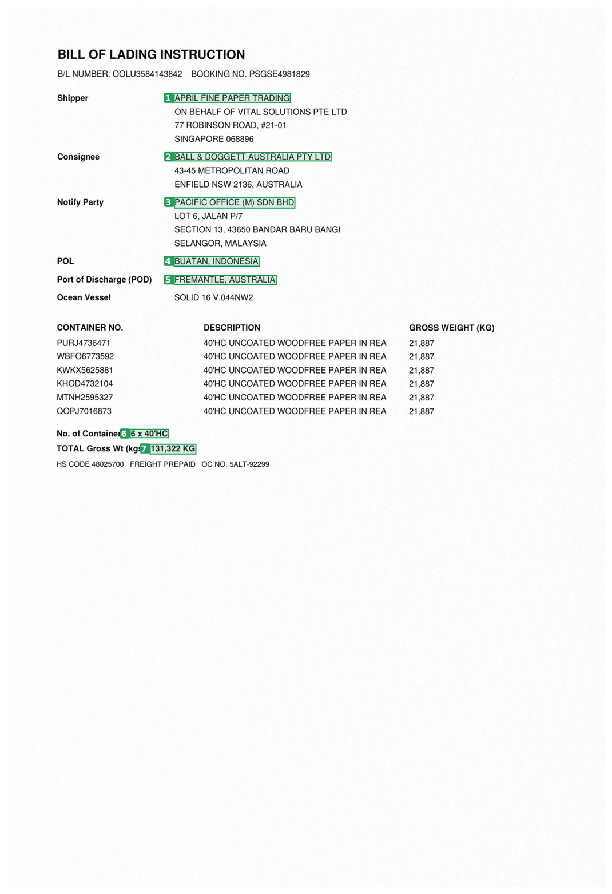

# Shipping document checker

Checks a **Shipping Instruction (SI)** against a **draft Bill of Lading (BL)** on seven fields (shipper, consignee,
notify party, port of loading, port of discharge, container count, gross weight) and tells you exactly what differs.

* **Quick check** - drop PDFs, Word, Excel, text files, photos, or a whole email (`.eml` / `.msg`). Instant result, the
  values shown *on the page* where they were read, fix-a-value-and-recompare, and a ready-to-send **draft reply**.
* **Scan with phone** - photograph the SI and the BL. Tilted, shadowed and sideways pages are straightened; a bad photo
  (blurry, dark, glare, too far) is rejected with a plain reason instead of being misread.
* **Inbox tabs** - the batch pipeline over the hackathon inbox: overview, emails, a human **review queue**, mismatch report.

Nothing is ever guessed: when a value is blank, unreadable or the two OCR readings disagree, it goes to a person.
Nothing is ever sent automatically. Uploaded files are processed in memory and are not saved.

---
## Run it (5 minutes, nothing to install except Docker)

### Windows
1. Install **Docker Desktop**: https://www.docker.com/products/docker-desktop/ (accept the defaults; restart if asked).
2. Open Docker Desktop and wait until it says it is running.
3. Unzip this project. **Double-click `start.bat`.**
4. The first run builds the app (a few minutes). Your browser opens at **http://localhost:8501**.

### Mac (Intel or Apple Silicon)
1. Install **Docker Desktop**: https://www.docker.com/products/docker-desktop/ and open it until it says it is running.
2. Unzip this project. **Double-click `start.command`.**
   * First time macOS may block it: **right-click -> Open -> Open**.
   * If it does not start, open Terminal in the folder and run `bash start.command`.
3. Your browser opens at **http://localhost:8501**.

**Stop:** double-click `stop.bat` / `stop.command`. **After you change any code:** run start again (it rebuilds).
Your results and review decisions live in the `out/` folder and survive restarts.

### Try it with the sample files (no data needed)
Open **Quick check** and press *Mismatch*, *All match* or *An email* - or open **Scan with phone** and press
*Photos with a mismatch*. The `samples/` folder has the same files, including bad photos that should be rejected.

### Optional: the hackathon inbox (Inbox tabs)
Copy the bundle's `inbox/` and `attachments/` folders into the `data/` folder here, refresh the page, and press
**Run pipeline** (sidebar -> *Inbox dataset*).

---
## Using a phone
1. Phone and computer on the **same Wi-Fi**. `start.bat` / `start.command` prints the address to type into the phone,
   e.g. `http://192.168.1.23:8501`.
2. Open **Scan with phone**, tap **Upload -> Take photo**. Your normal camera app opens (autofocus, flash) and this works
   over plain http. Photograph each document flat on a plain, darker surface, whole page in frame, good light.
3. Windows: if the phone cannot connect, allow Docker / port 8501 through the Windows firewall.

The in-browser *live camera* needs **https**. It is optional: `docker compose --profile https up`, then
`https://<computer-address>:8443` (accept the certificate warning once). This profile is **untested** - if it gives
trouble use the Upload route above, or `ngrok http 8501` and open the https link it prints.

---
## Troubleshooting
| Problem | Fix |
|---|---|
| "Docker is not installed / not running" | Install Docker Desktop, open it, wait for "running", start again |
| Windows: Docker asks about WSL 2 | Accept: Docker Desktop installs it for you, then restart |
| Port 8501 already in use | Edit `docker-compose.yml`: change `"8501:8501"` to `"8502:8501"`, open http://localhost:8502 |
| Phone cannot open the address | Same Wi-Fi? Firewall? A VPN on the computer can also block it |
| Inbox tabs are empty | Put `inbox/` and `attachments/` in `data/` (optional; Quick check does not need them) |
| Something else | `docker compose logs` and send it to the team |

---
## Without Docker (advanced)
`pip install -r requirements-streamlit.txt -r requirements-extras.txt`, install **Tesseract** and **poppler**, then
`streamlit run streamlit_app.py`. Windows needs poppler on PATH or set in the app's sidebar. Details, design decisions and
the test notes are in `docs/TECHNICAL_NOTES.md`. Tests: `python tests/test_pipeline.py`.

## What is where
`streamlit_app.py` the app - `pipeline/` the logic (`scan.py` photos, `intake.py` uploads and email, `evidence.py` page
boxes, `reply.py` drafts, `compare.py` / `extract.py` / `normalize.py` the checking) - `samples/` demo files -
`tools/make_samples.py` regenerates them - `tests/` - `Dockerfile`, `docker-compose.yml`, `start.*`, `stop.*`.

