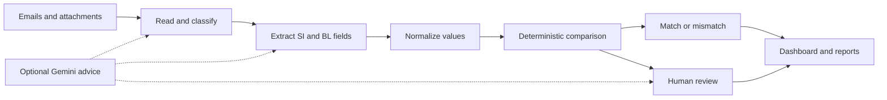

# DocuVerify

**Shipping document verification for the Averis Hackathon.**

DocuVerify classifies shipping correspondence, compares Shipping Instructions (SI) with draft Bills of Lading (BL), and routes incomplete or uncertain documents to a human reviewer. A Streamlit dashboard presents field-level evidence alongside each result.

**Code decides; AI advises.** Deterministic comparison rules determine match, mismatch, missing, and uncertain outcomes. Optional Gemini assistance supports ambiguous classification, extraction, and review without replacing definitive comparison results.

## Contents

- [Features](#features)
- [How It Works](#how-it-works)
- [Quick Start](#quick-start)
- [Usage](#usage)
- [Repository Structure](#repository-structure)
- [Testing](#testing)
- [Written Responses](#written-responses)
- [Contributing](#contributing)
- [License](#license)

## Features

- **Email triage:** comparison requests, shipping-instruction requests, invoice queries, general correspondence, and spam.
- **Document comparison:** shipper, consignee, notify party, loading port, discharge port, container count, and gross weight.
- **Multiple input formats:** text, PDF, Word, spreadsheets, images, and email intake through the pipeline. The dashboard accepts the formats listed in its upload control.
- **OCR and photo checks:** document extraction, rotation handling, and retake guidance for poor-quality photos.
- **Human review:** source evidence, advisory AI suggestions, reviewer notes, and saved decisions.
- **Dashboard:** batch overview, scanner, review queue, comparison explorer, and category distribution.
- **Reports:** detailed JSON, readable Markdown, review queues, and hackathon submission JSON.
- **Optional API:** a FastAPI prototype that runs the bundled dataset and stores submission results in Google Cloud Storage.

## How It Works



Document roles are identified from content rather than filenames. Normalization accounts for company suffixes, punctuation, port codes, weight units, and container notation. Blank or unreadable values are escalated instead of silently accepted.

See [architecture and development notes](docs/architecture.md) for the rules and known ambiguities. The separately contributed [cloud architecture diagrams](docs/cloud-architecture-proposal.md) are preserved as a proposal, with implementation gaps identified.

## Quick Start

### 1. Clone and install

Use **Python 3.11 or newer**; the Docker image uses 3.11.

```bash
git clone https://github.com/Lesterjp29/-J-AverisHackathon.git
cd ./-J-AverisHackathon
python -m venv .venv
```

Activate the environment:

```powershell
# Windows PowerShell
.\.venv\Scripts\Activate.ps1
```

```bash
# macOS / Linux
source .venv/bin/activate
```

Install Python dependencies:

```bash
python -m pip install -r requirements.txt
```

### 2. Install document tools

PDF and image processing require **Poppler** (`pdftotext`, `pdftoppm`) and **Tesseract OCR**.

```bash
# Debian / Ubuntu
sudo apt-get update
sudo apt-get install poppler-utils tesseract-ocr

# macOS with Homebrew
brew install poppler tesseract
```

On Windows, install both tools and add their executable directories to `PATH`, or set `POPPLER_PATH` and `TESSERACT_CMD` in your shell. The app also searches common installation directories.

```bash
python -m pipeline.env
```

### 3. Launch the dashboard

Run from the repository root:

```bash
python -m streamlit run app.py
```

Open the local URL printed by Streamlit, usually `http://localhost:8501`. The dashboard initially displays the checked-in sample report. After a batch run, it reads `outputs/sample/` instead.

### 4. Optional AI configuration

Copy [.env.example](.env.example) to `.env`, then add your own `GEMINI_API_KEY`. `GEMINI_MODEL` can override the model name. The app loads this file locally; never commit credentials.

Without a usable key, deterministic processing remains available. Set `DOCUVERIFY_DISABLE_AI=1` to explicitly prevent model calls. With AI enabled, ambiguous document/email content may be sent to Gemini for advice.

The optional API has separate dependencies and configuration: see [deployment notes](docs/deployment.md).

## Usage

### Try a document pair

Open **Document Scanner** and choose a matching or mismatching sample, or upload your own SI and BL. More demo inputs are in [`data/demo/`](data/demo/), including email and simulated phone-photo fixtures.

### Process the bundled inbox

```bash
python -m pipeline.run
# Equivalent explicit paths:
python -m pipeline.run data/sample --out outputs/sample
```

Custom datasets must contain `inbox/email_*.json` and attachment paths relative to the dataset directory, normally `attachments/`.

```bash
python -m pipeline.run path/to/dataset --out outputs/custom
# Only use --submit with an authorized, compatible organizer HTTP service:
python -m pipeline.run http://localhost:8080 --out outputs/server --submit
```

The organizer data service is separate from this repository's optional `/run` and `/results` API, which does not implement inbox or scoring endpoints.

### Review and retry

Reviewer decisions are saved to `outputs/resolutions.json`. Apply them when rerunning a batch:

```bash
python -m pipeline.run data/sample --out outputs/sample --resolutions outputs/resolutions.json
python -m pipeline.run data/sample --out outputs/sample --retry email_511
python -m pipeline.run data/sample --out outputs/alternative --ask-send-as BL_COMPARISON
```

See [example resolutions](examples/resolutions_example.json) for decision and correction formats. `--retry` merges selected results into the existing report.

| Output | Purpose |
| --- | --- |
| `report.json` | Detailed classifications, results, and evidence |
| `report.md` | Human-readable comparison summary |
| `review_queue.json` | Cases requiring a reviewer |
| `submission.json` | Hackathon submission format |

Reference snapshots live in [`examples/reports/`](examples/reports/). New reports and review decisions live in ignored [`outputs/`](outputs/README.md).

## Repository Structure

```text
.
├── app.py                      # Streamlit entry point
├── pipeline/                   # Classification, extraction, comparison, OCR, API
│   ├── loader.py               # Local/HTTP inbox adapter
│   ├── paths.py                # Shared repository-relative paths
│   ├── run.py                  # Batch CLI
│   └── api.py                  # Optional cloud-storage API
├── ui/                         # Presentation helpers and CSS
├── data/
│   ├── sample/                 # 520-email bundle and submission template
│   ├── stress/                 # 10 difficult email fixtures
│   └── demo/                   # Upload pairs, email, and photo examples
├── examples/
│   ├── resolutions_example.json
│   └── reports/                # Sample, alternative-label, and stress snapshots
├── outputs/                    # Ignored local results and review decisions
├── tests/                      # Pipeline, UI, and repository-layout checks
├── docs/                       # Architecture and deployment notes
├── .streamlit/config.toml      # Dashboard theme
├── .env.example                # Configuration template without credentials
├── Dockerfile                  # Optional API container
├── packages.txt                # System dependencies for Streamlit hosting
├── requirements.txt            # Core app dependencies
├── requirements-api.txt        # Optional API and cloud dependencies
└── requirements-dev.txt        # Test dependencies
```

## Testing

```bash
python -m pip install -r requirements-dev.txt
python -m pytest tests -q
```

The suite covers normalization, role detection, missing values, stress fixtures, Streamlit navigation, upload/email intake, photo quality, evidence location, reply drafts, and submission shape. OCR tests require the system tools above. Regression tests disable external AI calls and generate stress results in temporary storage.

The legacy HTTP-UI test is skipped when the active interface is Streamlit. An older README referenced `tests/test_ui.py`; current dashboard checks are in `tests/test_pipeline.py`.

## Written Responses

### Problem–Solution Alignment

Shipping teams receive SI and draft BL documents in inconsistent formats. Repeated manual checks can overlook party-name, port, container-count, or weight discrepancies, while missing documents and low-quality scans slow review.

DocuVerify combines classification, extraction, comparison, and human review. It normalizes harmless formatting differences and shows evidence for discrepancies. Incomplete or unreliable input goes to review rather than producing an unsupported clearance decision.

### AI and Cloud Infrastructure Integration

The project combines deterministic Python rules with optional Gemini assistance for ambiguous classification, missing-field extraction, and uncertain comparisons. Definitive comparison outcomes remain controlled by code; unavailable AI assistance falls back to the local pipeline.

The repository includes a FastAPI service, Dockerfile, and Google Cloud Storage integration for uploading and retrieving `submission.json`. These are implementation components, **not evidence of a live deployment**. No live cloud deployment has been confirmed. The synchronous API prototype still needs authentication, isolated jobs, and operational controls before public production use.

### User Feedback / Testing

Development feedback emphasized accessible controls, readable values, and layouts that fit smaller screens. The interface includes responsive layouts, labeled forms, keyboard focus indicators, contained table scrolling, and review drafts that survive in-session page changes.

Validation is based on regression tests, sample documents, difficult fixtures, and development UI checks. **No formal external user study or customer feedback results are available.** The next step is to observe shipping coordinators performing comparison and review tasks, recording completion rates, errors, and time spent finding evidence.

### Coding Challenges

| Challenge | Approach |
| --- | --- |
| Different number formats and units | Normalize weights and container notation |
| Reused or misleading email subjects | Prioritize message body and attachment content |
| Incorrect or swapped filenames | Detect document roles from content |
| OCR noise and poor photographs | Check OCR consistency and provide retake guidance |
| Blank fields resembling valid data | Preserve missing values and route to review |
| Explaining discrepancies | Retain evidence and show SI/BL values together |
| Consistent UI and batch behavior | Reuse intake and comparison logic |

The [development notes](docs/architecture.md) document additional tradeoffs, including requests that ask for a BL to be sent without supplying documents to compare.

### Success Metrics

These counts come from **checked-in reference reports**, not external ground-truth scoring or a new production benchmark:

| Reference measure | Recorded value |
| --- | ---: |
| Emails in the sample report | 520 |
| Comparison requests | 129 |
| Matching comparisons | 65 |
| Mismatching comparisons | 46 |
| Comparisons requiring review | 18 |
| Deliberately difficult stress fixtures | 10 |

Sources: [sample report](examples/reports/sample/report.json) and [stress report](examples/reports/stress/report.json). Counts can change with OCR tools, model configuration, and reviewer decisions. Earlier development notes describe a different run and remain historical context.

Future evaluation should measure classification precision/recall, field-level mismatch recall, false-clearance rate, reviewer correction rate, processing time, and cost per document. **No production accuracy, time-saving percentage, latency benchmark, or cost claim has been established.**

### Scalability Plans

The current app is a local/file-backed prototype. Planned improvements are to:

1. Move long OCR and batch jobs to a queue with independent workers.
2. Store documents and reports under separate job identifiers.
3. Persist reviewer decisions and audit history in a database.
4. Add authentication, role-based access, retention policies, and upload limits.
5. Add retries, idempotent execution, monitoring, and failure recovery.
6. Benchmark OCR throughput and model cost before setting concurrency limits.

These are proposed next steps, not shipped capabilities.

## Contributing

Open an issue describing the problem, or submit a focused pull request with reproduction steps and relevant test results. Keep UI work in `ui/` and `app.py`, processing logic in `pipeline/`, and reusable fixtures in `data/`. Do not commit credentials, real customer documents, or local reviewer decisions.

## License

No license file has been provided. Reuse and redistribution terms remain unspecified; contact the repository maintainers before assuming a license.
