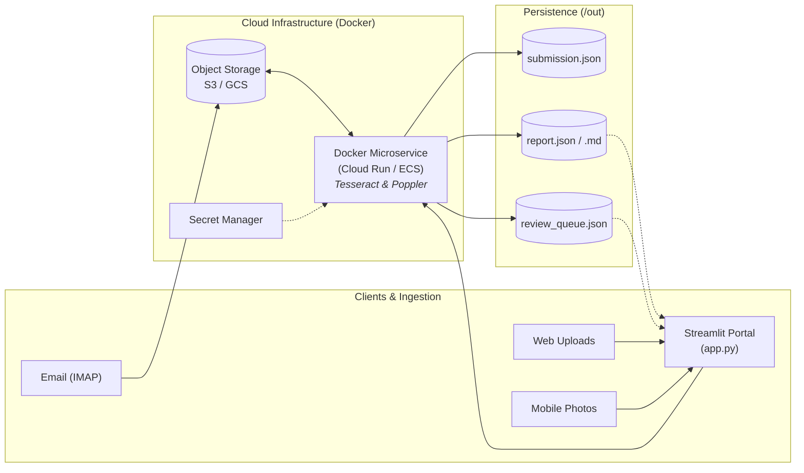
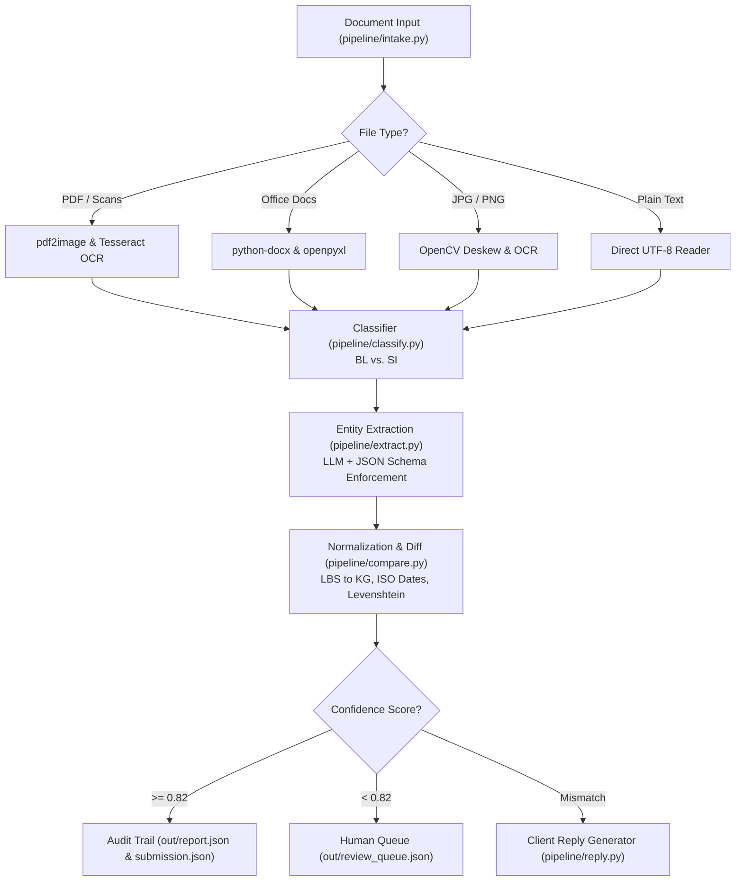

# Cloud Architecture Proposal

These diagrams preserve the architecture contribution merged from GitHub (`fdff8fe`). They are a design proposal, not a verified deployment or an exact map of current implementation.

The following distinctions apply:

- IMAP ingestion, S3 support, Secret Manager integration, and Cloud Run/ECS deployment have not been implemented or verified in this repository.
- The Streamlit app currently invokes the Python pipeline directly; it does not send uploads to the optional Docker API.
- The existing API uploads submission results to Google Cloud Storage. A shared input object-storage workflow is proposed.
- `/out` and `out/...` in the diagrams refer to historical paths; generated reports now belong under `outputs/sample/`.
- Current PDF readers use Poppler command-line tools and Tesseract; the diagrams' `pdf2image` label is illustrative.
- Document-role detection, email classification, extraction, and deterministic comparison are separate stages. The depicted universal confidence cutoff of 0.82, ISO-date normalization, and JSON-schema enforcement do not describe the current comparison implementation.

See [the README](../README.md#how-it-works) for the implemented workflow and [deployment notes](deployment.md) for the API's current behavior and limitations.

## Technical Architecture

### 1. System Topology & Infrastructure

### 2. Document Processing & Audit Pipeline

